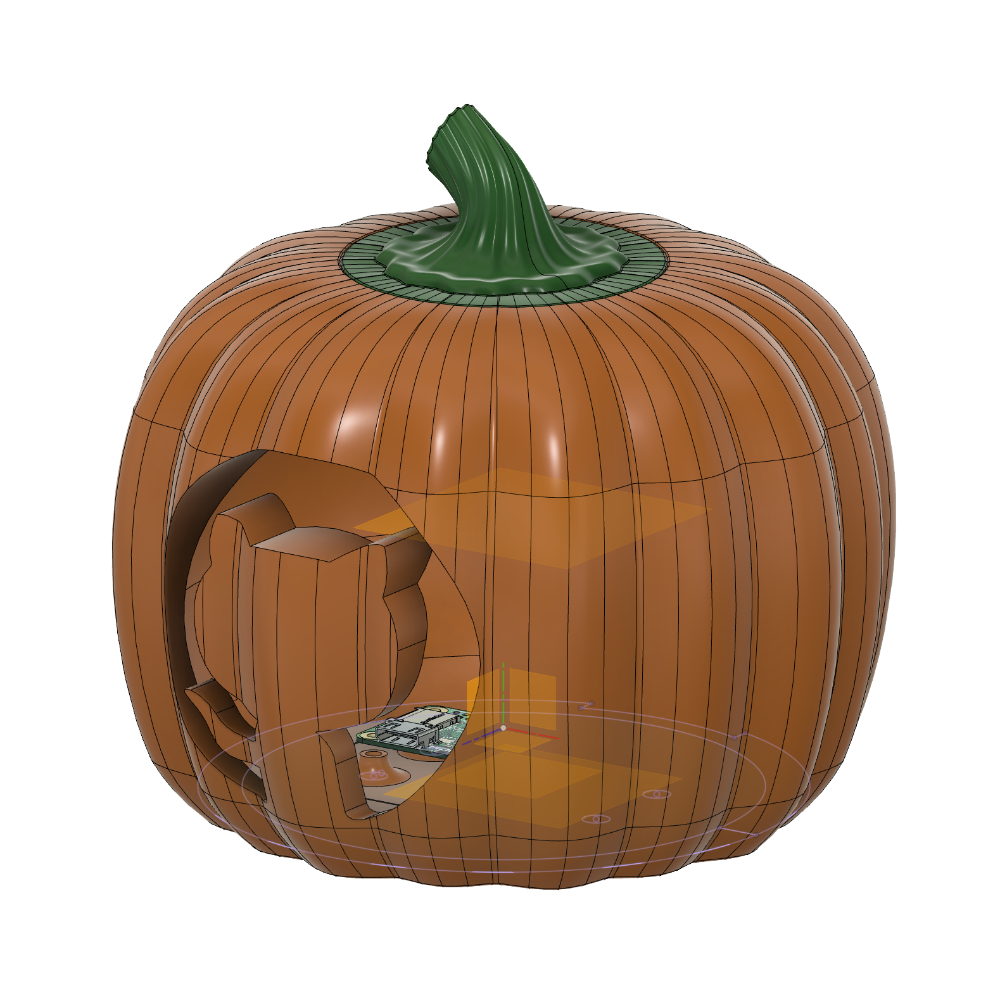

# PumpkinPi
Spooky build status indicator.



## Hardware Requirements:
This project makes use of the following:
 - Pumpkin - Carve a real one or you can always 3D print one
 - Raspberry Pi Zero WH  ([UK](https://amzn.to/33rmXEc), [US](https://amzn.to/3lcQLul))
 - Pimori Unicorn pHat  ([UK](https://amzn.to/3l8rPnR), [US](https://amzn.to/30wEWaG))
 - Micro SD Card  ([UK](https://amzn.to/2SoRagP), [US](https://amzn.to/2GeMWWT))
 - USB power - I used the official Raspberry Pi Charger ([UK](https://amzn.to/33qvreN), [US](https://amzn.to/36yKkh4)) but you can also power with a USB battery pack.

 ### 3d Printed Pumpkin
 For the [3d printed pumpkin case](stl/), you will need:
  - Glow in the Dark PLA Filament for body  ([UK](https://amzn.to/2SmQzwj), [US]())
  - Green PLA Filament for top  ([UK](https://amzn.to/2GeMlo7), [US](https://amzn.to/30vuAHX))
  - Adafruit Panel Mount Extension USB Cable - Micro B Male to Micro B Female [ADA3258] ([UK](https://amzn.to/3irYgf9), [US](https://amzn.to/34pR51V))
  - 4 x M2.5 threaded brass inserts ([UK](https://amzn.to/3ixudCK), [US](https://amzn.to/33rnYw0))
  - 4 x M2.5 male PCB standoffs & screws - keep a kit of thise handy if you don't have some. ([UK](https://amzn.to/3cYGkYE), [US](https://amzn.to/3l8VDk8))

When ordering online, while Amazon ([US](https://amzn.to/2CUGild)) and Amazon ([UK](https://amzn.to/2PbHDtz)) are always handy places (especially if you are a Prime member) I also highly recommend [AdaFruit](https://www.adafruit.com/) for electronics purchases in the US and [PiHut](https://thepihut.com/) in the UK. They basically should just park a truck at my house and take all my money.

## Getting Started

Format the micro SD Card and [install Praspberry Pi OS Lite](https://www.raspberrypi.org/downloads/raspberry-pi-os/). If installing onto a Pi Zero you might not have the keyboard and HDMI adopters lying around so you probably want to do a [headless install](https://www.raspberrypi.org/documentation/configuration/wireless/headless.md), configuring SSH and WiFi by dropping an `ssh` file and a `wpa_supplicant.conf` file onto the root of the SD card after copying over the Raspbian files.

You'll need to install the [Unicorn HAT](https://github.com/pimoroni/unicorn-hat) software but they have a cool one-line installer that takes care of all the dependencies including Python and Git.

``\curl -sS https://get.pimoroni.com/unicornhat | bash``

In addition, we'll be using the ``requests`` module in python so after installing the Unicorn HAT software, install the ``requests`` module with the following command

``sudo pip install requests``

Next you want to clone this git repo. I have it at the root of the standard ``pi`` user

``git clone https://github.com/martinwoodward/PumpkinPi.git``

You need to modify the settings to point at your build badge. First of all copy the sample settings provided in the repo:

``cp ~/PumpkinPi/src/local_settings.sample ~/PumpkinPi/src/local_settings.py``

Then edit the ``BADGE_LINK`` variable and point at the URL of your Build badge.

```python
# Build Badge for the build you want to monitor
BADGE_LINK = "https://github.com/martinwoodward/calculator/workflows/CI/badge.svg?branch=main"
# How often to check (in seconds). Remember - be nice to the server. Once every 5 minutes is plenty.
REFRESH_INTERVAL = 300
```

Finally you can run the script as root

```
sudo python ~/PumpkinPi/src/pumpkinpi.py &
```

Once you are happy everything is running how you want, don't forget you can run the script at boot time. The easiest way to do this is to use crontab. See this [cool video from Estefannie over on the Raspberry Pi blog](https://www.raspberrypi.org/blog/how-to-run-a-script-at-start-up-on-a-raspberry-pi-using-crontab/) to learn more. 


