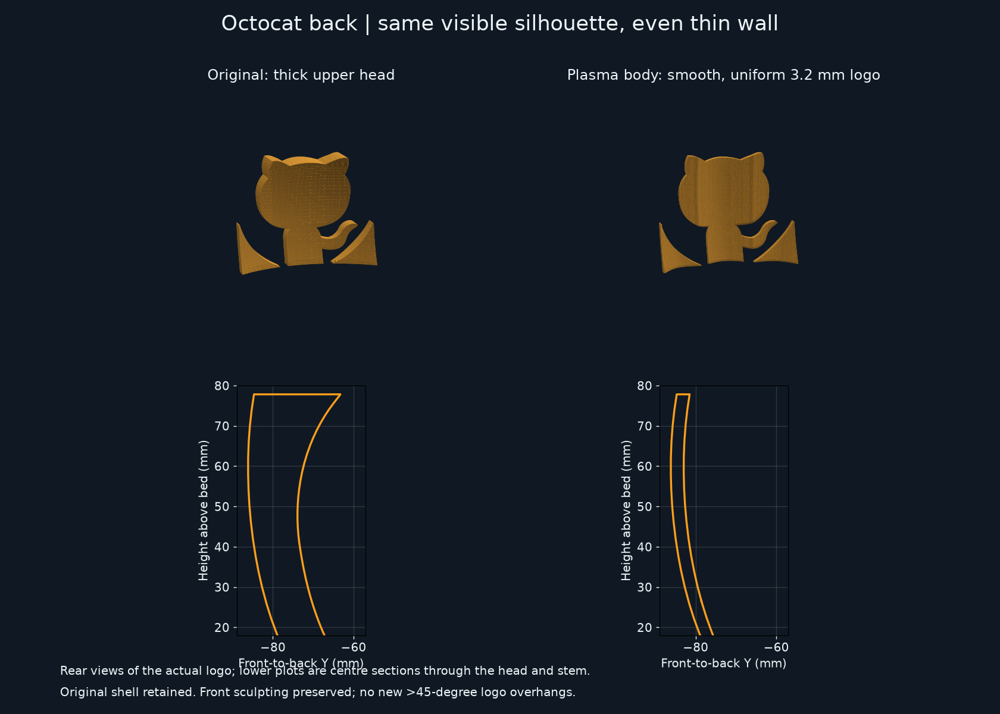
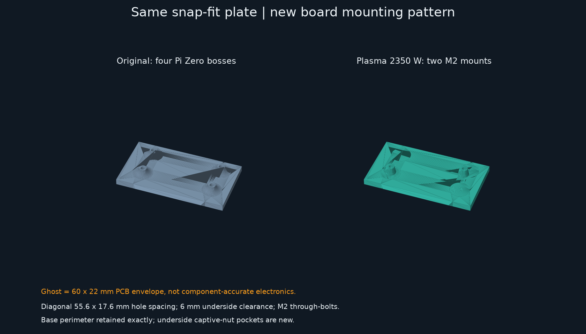
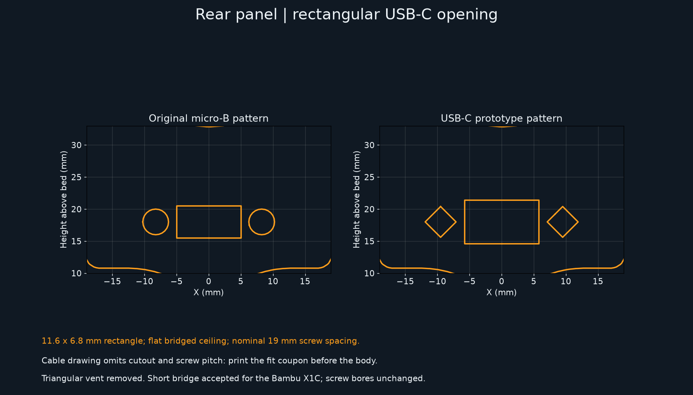

# Plasma 2350 W PumpkinPi models

These are new variants; the original Pi Zero STLs remain unchanged in the parent
directory. All dimensions are **millimetres**. New files are **Z-up, base on Z=0**,
ready for normal upright printing. Do not auto-rotate them onto their sides.

| File | Purpose |
| --- | --- |
| [plasma2350-holder.stl](plasma2350-holder.stl) | Plasma 2350 W insert, retaining the original snap-fit perimeter |
| [pumpkin-body.stl](pumpkin-body.stl) | Original shell with an evenly thinned Octocat and revised USB-C panel opening |
| [usb-c-fit-coupon.stl](usb-c-fit-coupon.stl) | Small, flat-printed connector-pattern trial; print this first |
| [measurements.json](measurements.json) | Regenerated mesh measurements and geometry checks |

Use the existing [pumpkin-plug.stl](../pumpkin-plug.stl) for the stalk. It is still
in the legacy Y-up orientation: rotate it -90 degrees about X and place its bottom
on the bed when printing separately.

## Holder

The board is **Plasma 2350 W**, not a Pi Zero or the non-wireless Plasma 2040.
Pimoroni specifies a 60 x 22 mm PCB and an approximately 61 x 22 x 12 mm assembled
envelope including connectors. The new insert has two diagonal mounting bosses,
not the Pi Zero's four.

The [W-specific pinout drawing][pinout-w] and the [originally supplied pinout][pinout]
show two M2 mounting holes. The inferred centre separation is **55.6 x 17.6 mm**:
the vector drawing places their centres 2.2 mm in from each PCB edge. This pitch is
measured from the scaled drawing, not explicitly dimensioned by its author.
Check it against the physical board before tightening screws.

- Boss tops are at Z=11: **6 mm clearance above the plate** for underside components.
- Two **2.4 mm through-bores**, with **4.3 mm across-flats, 2 mm deep M2 nut pockets**
  entered from below. The pockets taper into the bores to avoid horizontal roofs.
- Use two M2 nuts and approximately **M2 x 12 mm screws**, adjusting length for
  actual PCB thickness and washers. Use insulating washers and do not overtighten.
  Do not substitute the old M2.5 inserts.
- Retained plate envelope: **89 x 54 mm**, with the original 5 mm thick snap profile.
  Screws/nut pockets only alter its interior, not the mating rim.
- Both board ends are open for the USB-C plug and LED terminal wiring. The preview
  ghost is a PCB envelope, not a component-accurate clearance model.
- Install the board and cable on the holder before snapping it into the pumpkin;
  keep the 30 cm cable loosely routed around the interior, away from LED wiring
  and the wireless module. Check the actual 37 mm plug/strain-relief envelope and
  cable bend radius during dry assembly.

## Body and support constraints

The body retains the original shell and crown, with a locally smoothed Octocat
and the USB-C revision described below.
The first 6 mm of the body and the stalk seat from Z=112 upward are unchanged.

### Smooth Octocat back

The Octocat has a **3.2 mm front-to-back wall** instead
of letting the general cavity leave ridges and a thick wedge behind its head.
The back follows a smooth offset of the existing sculpted front, preserving the
visible silhouette and outer surface. The lower front wall continues the relief
into the original base, without a new unsupported ledge. The surrounding crown
still retains its support-free roof; only the logo is uniformly thinned.

This dimension is measured along Y (front to back), not perpendicular to every
facet of the curved exterior. The generator checks 2,266 points across the head,
stem and tail; the exported surfaces measure **3.17-3.26 mm**, excluding rays
grazing the original cutout bevels. It also checks the front surface is unchanged
and introduces no new steep underside faces. The smooth offset is reconstructed
from the source exterior, not from the jagged old inner wall.

### Printing

The generator checks the actual exported meshes are single watertight solids,
checks both old/new holders against the body, and rejects newly introduced downward
faces above 45 degrees **except the flat USB ceiling**. This is an explicitly
accepted **11.6 mm bridge for the Bambu X1C**; the exception is constrained to that
ceiling, not the rest of the shell. The source pumpkin already contains steep
faces/bridges, so not every pre-existing face is below that angle. Inspect the sliced
layers, particularly the face and rear connector, with bridging enabled.

Starting point: PLA, 0.4 mm nozzle, 0.2 mm layers, 3-4 perimeters, 10-15% infill,
supports off, brim only if needed for bed adhesion. Use the same settings when
comparing slicer filament estimates. Glow PLA is abrasive; use a
suitable nozzle. No physical test print or thermal test has been performed.

## USB-C panel mount: provisional fit, coupon first

The supplied [BTFO USB-C panel extension][cable] drawing gives:
30 cm cable, 25 x 10 mm flange, approximately 35 mm female housing length,
37 mm male housing length and 9 mm screws. **It does not specify screw-centre
spacing, screw diameter, through-panel cutout or rear housing cross-section.**
Do not infer a guaranteed fit from the illustration.

The old micro-B opening was 10 x 5 mm with bores on a 16.5 mm pitch. The Plasma body
uses:

- An **11.6 x 6.8 mm rectangular opening** with a flat, bridged ceiling.
- Nominal **19 mm screw pitch** with 4.8 mm diagonal diamond bores. Their inscribed
  circular diameter is about 3.39 mm; these are clearance holes, not printed threads.
- The same recessed rear position and 2 mm mounting face.
- No triangular vent above the opening. The 6.8 mm height fits within the pictured
  centred 10 mm-high flange, without the previous 4.2 mm protruding tip. This is
  still not a sealed or weatherproof connector mount.

Print `usb-c-fit-coupon.stl` (34 x 19 x 2 mm) first, use the supplied cable to verify
the aperture and screws, and measure the flange and inner moulding against the
recess. **The coupon checks the face pattern, not rear housing or cable clearance.**
Check the supplied 9 mm screw engagement in the actual connector; add washers or
use shorter screws if they bottom out. Never force the plastic or connector.

If needed, update `MOUNT_X` (half the screw pitch), `PORT_WIDTH`, and `PORT_HEIGHT`
in the generator, then regenerate **both the coupon and body**. Verify that
there is still material between holes and that the flange covers the intended
opening. A measured connector cutout drawing is required to finalize this fit.

## Rebuild and previews

From the repository root:

```sh
python3 -m venv .venv
.venv/bin/python -m pip install -r stl/tools/requirements.txt
.venv/bin/python stl/tools/build_plasma.py
```

The generator uses the original binary STLs as source, not an approximate
replacement pumpkin. It preserves their licence and produces new binary STLs,
measurement JSON and the previews below. No CAD application is required.







See the [preview gallery](../../images/plasma-2350-w/index.html) and
[Copilot credit-lamp implementation plan](../../docs/plasma-copilot-plan.md).

[pinout]: https://cdn.shopify.com/s/files/1/0174/1800/files/plasma2350_pinout_diagram.pdf?v=1723124465
[pinout-w]: https://cdn.shopify.com/s/files/1/0174/1800/files/plasma2350_w_pinout_diagram.pdf
[cable]: https://www.amazon.co.uk/dp/B0H7S5WSC5
